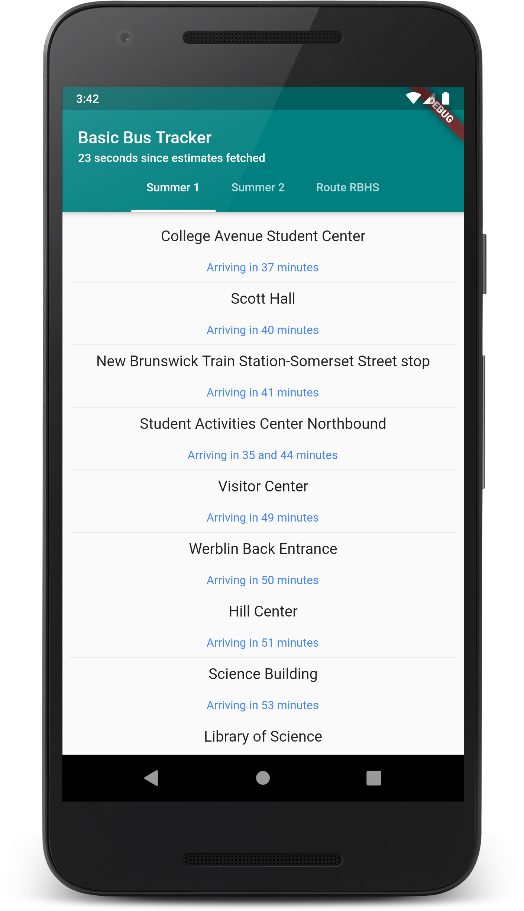
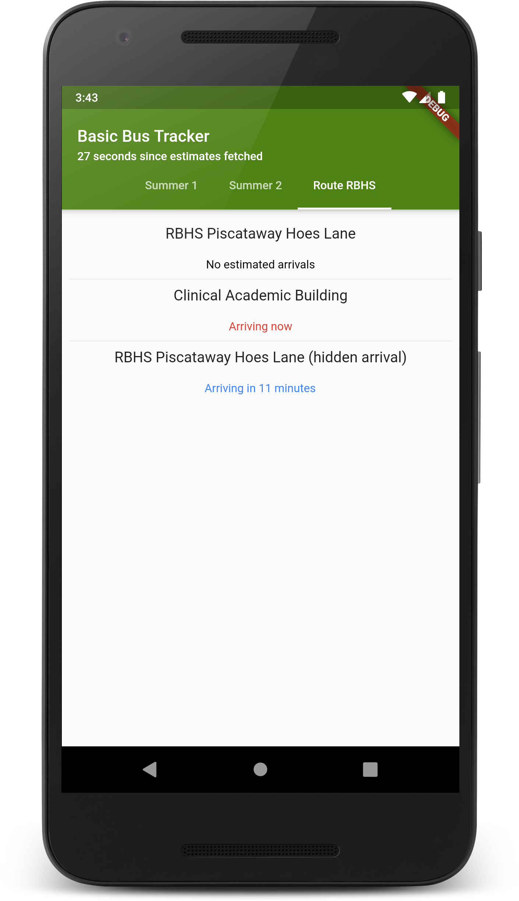
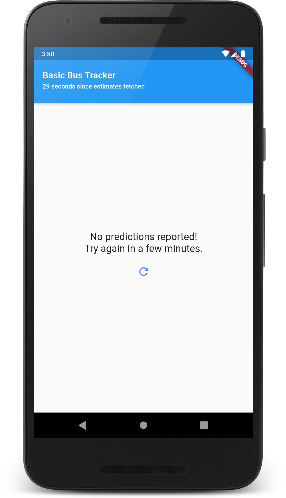

# Basic Bus Tracker (Flutter edition)

*Another* Rutgers bus tracker, written to get a feel for app development in Flutter.

Closely based on my [React Native Rutgers bus tracker](https://github.com/mileskrell/basic-bus-tracker-react-native), but with some nice additions.

## Features

- Swipe to refresh
- For convenience, sorts weekend routes before others (such as the RBHS and New BrunsQuick routes)
- Displays time since estimates were last fetched
- Toolbar/status bar color changes based on currently selected route (it looks pretty neat)

## Screenshots

| Summer 1 | RBHS Route | No predictions |
| - | - | - |
|  |  |  |
